# CENG-4501 – Software Design Patterns (Fall 2025)

This repository contains implementations of several key **software design patterns** studied in the course **CENG-4501 Software Design Patterns**.  
Each pattern is implemented in Java with simple examples to demonstrate its intent, structure, and usage.

---

## 📂 Patterns Covered

- 🟢 **Strategy Pattern**
- MOVING  FROM INHERITENCE INTO COMPOSITION
  
  Example: Duck behaviors with interchangeable flying and quacking behaviors 

  How class diagram is before applying stragtegy pattern:
  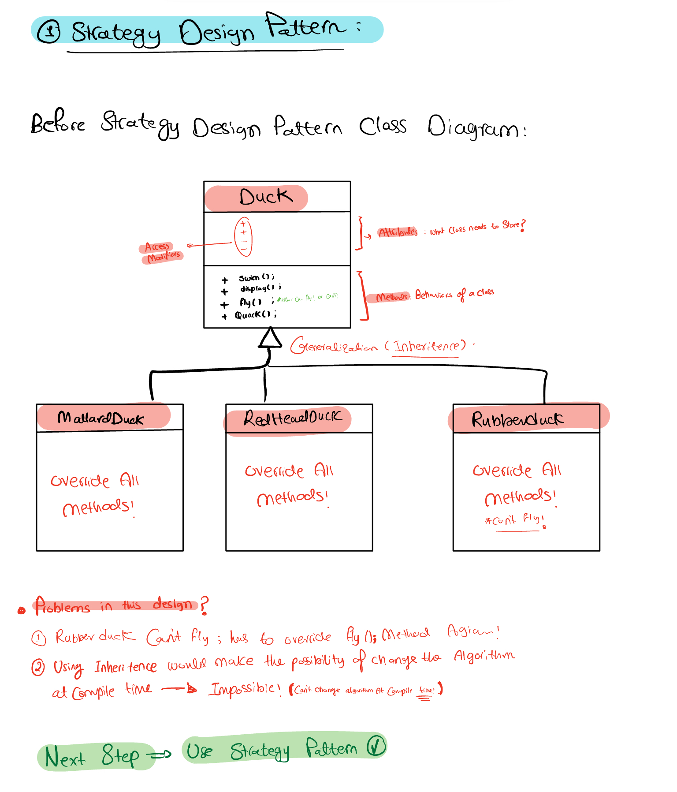
  After applying :
   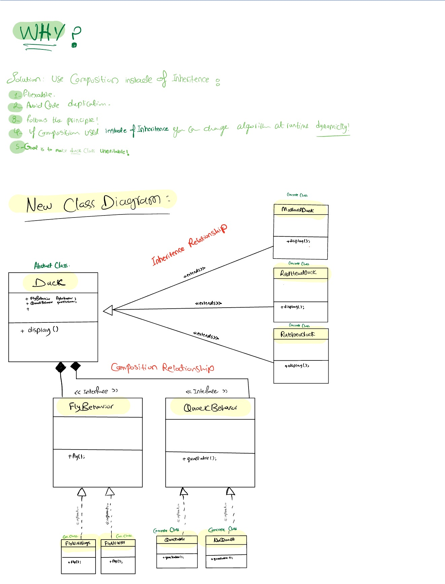
 
  📺 YouTube Video: *COMING SOON!*

- 🔵 **Observer Pattern**
- MOVING FROM PULL TO PUSH!
  
  Example: Weather station and display devices.
  
  How class diagram is before applying Observer pattern:
  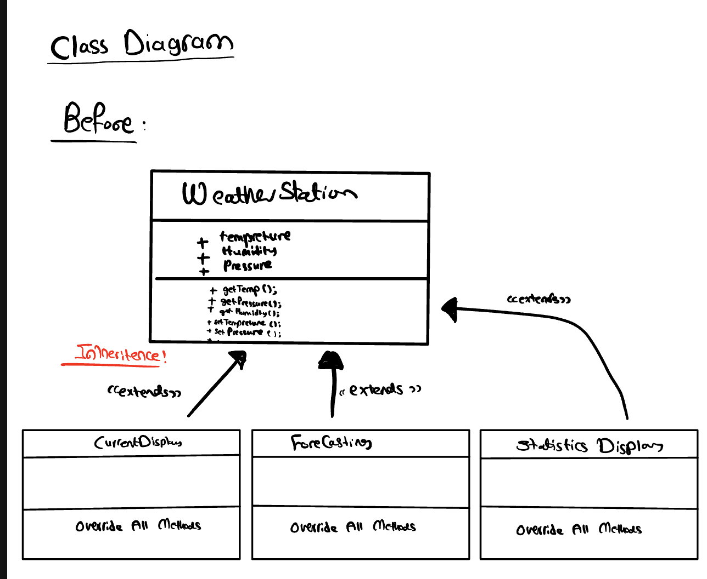
  
  After applying Observer pattern :
   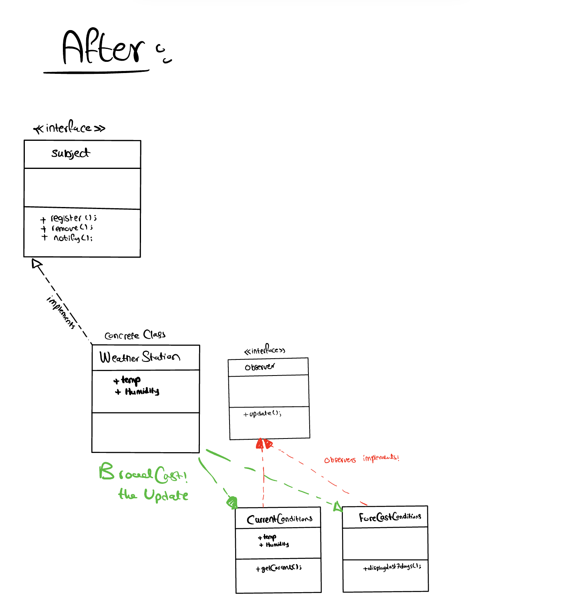

- 🟣 **Decorator Pattern**
- CHANGING THE CONTENT OR BEHAVIOR OF AN OBJECT AT RUNTIME

  Problem before applying the pattern:
  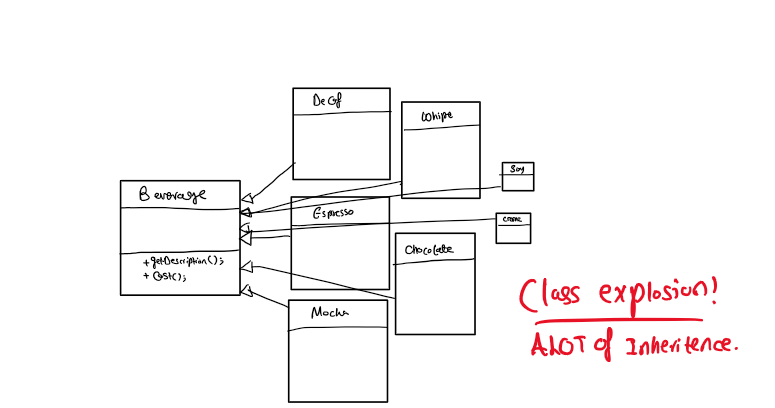

  After applying the pattern:
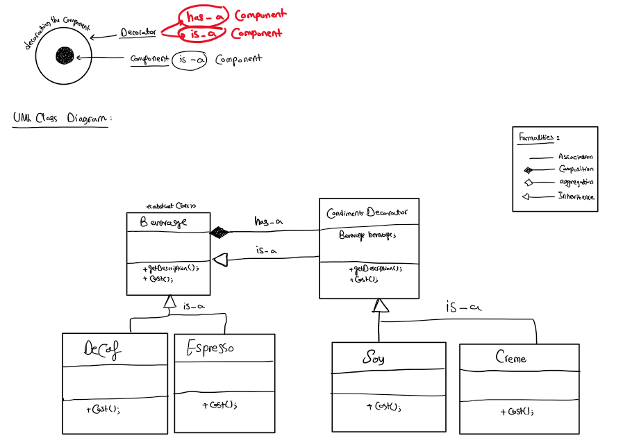
  
  Example: Star link Coffe`
  Adding condiments to a coffee (Decorating the coffee)

- 🟠 **Factory Pattern**  
  Example: Pizza store
  
  1- Simple Factory pattern
  
  Before:
  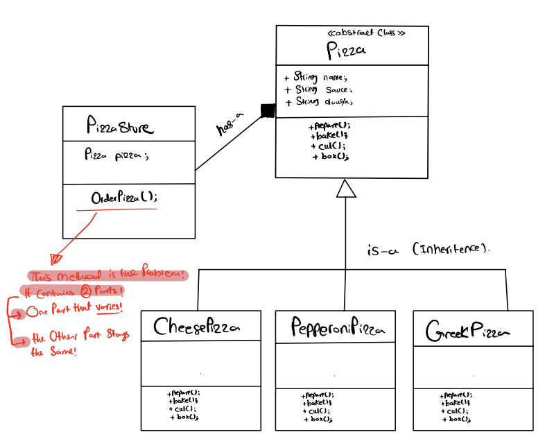
  
  After:
  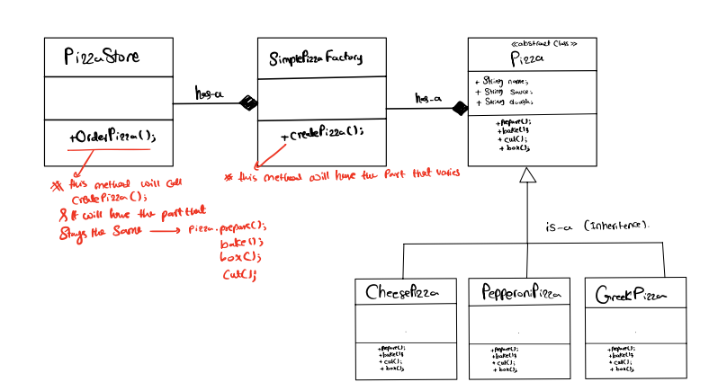

  
  2- Factory Method pattern
  
  Before:
  
  
  After:
  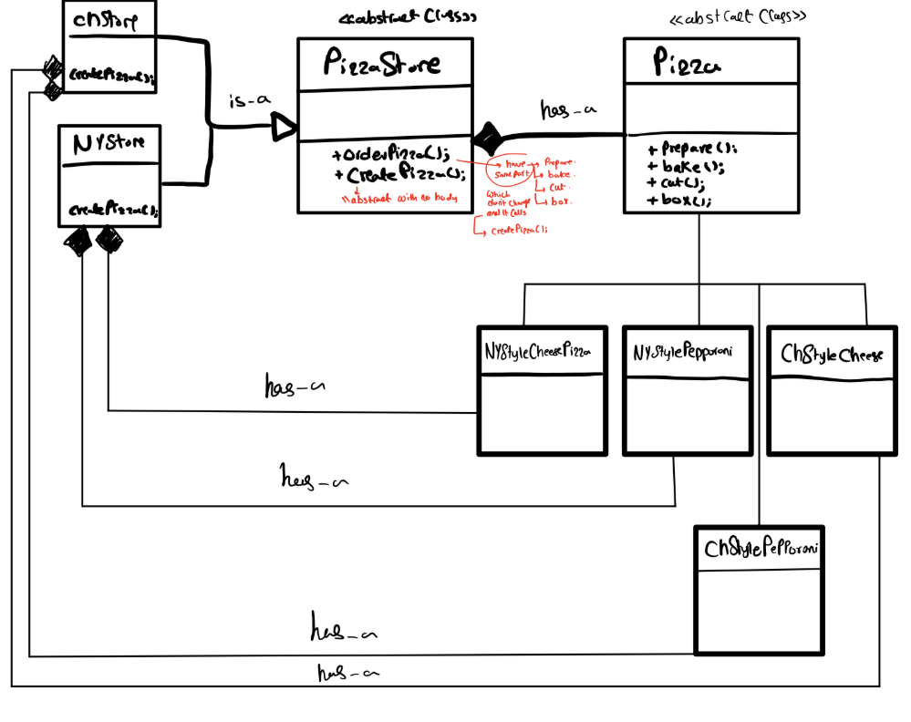
  
  3- Abstract Factory pattern
  
  Before:
  
  After:
- 🔴 **Singleton Pattern**
  
   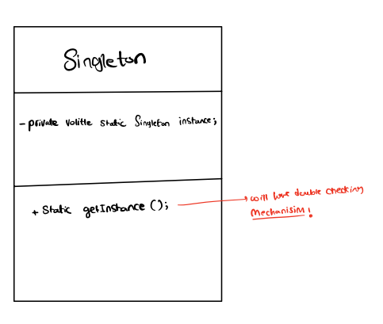
  
- 🟡 **Command Pattern**  
  Example: Remote control which closes Lights or another IOT devices connected to the remote by a command!
  - Concrete Invoker could be : remote control.
  - Concrete Command could be : TurnOnLightCommand.
  - Reciver is the Light class which has On(); and Off Methods.
  
  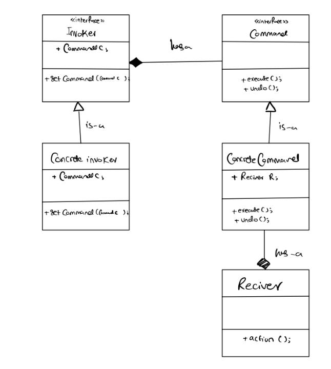


## 🛠️ How to Run

1. Clone this repository by running:  
   ```bash
   git clone https://github.com/U210709718/CENG-4501-Software-Design-Patterns.git
